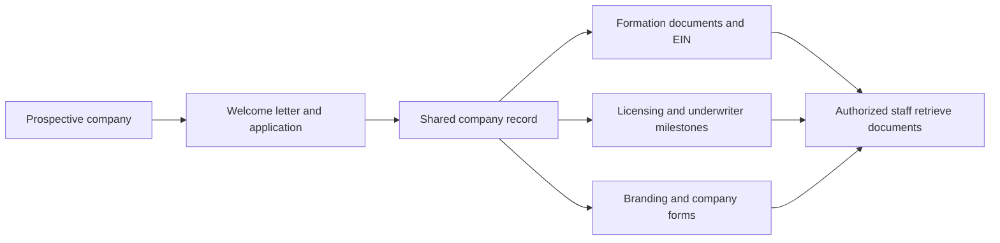

# Discovery brief: title-company operations workspace

Prepared September 11, 2026 from the supplied 27-minute, 50-second call recording.

> Historical discovery recommendation. The later instruction expands the MVP to Tyler’s policy production, Stephenie’s onboarding, John’s financial review, and partner access. The current implementation scope is documented in [the system blueprint](../system-blueprint.md). This earlier vault-first recommendation is retained for traceability, not as the current build scope.

## Main finding

The strongest first-release direction is a **shared company onboarding and document vault for Stephenie and John**. Its immediate job is to put each company's information and documents in one place so either person can retrieve what they need without calling the other.

The call begins with a valuable SoftPro automation opportunity, then moves into company onboarding, shared documents, partner access, and reporting. Stephenie repeatedly identifies her own onboarding work as the starting point, culminating in the shared file-vault description at **25:54–26:22** and a preference for gradual adoption at **27:23–27:37**. That is the best evidence for prioritizing the first release.

A useful product statement is: **“Open a company, see its onboarding progress, and find the right document.”** Onboarding progress is a proposed enhancement; shared company records and document access are directly requested in the call.

## Evidence and interpretation

This is discovery evidence, not a finalized specification. At the time of this initial brief, the request was for analysis before building. The subsequent request authorizes the broader local MVP. Statements in the recording about building, contacting people, installing integrations, or sending documents have not been executed.

The analysis uses a locally generated machine transcript without verified speaker labels. Names, industry terms, and timestamps may contain transcription errors. Role attribution follows the conversation's context. A repetitive generated ending extending beyond the actual recording has been excluded from the readable transcript and from the findings. The untouched machine output is retained locally for traceability.

Throughout this brief:

- **Reported** means described or requested in the call; it is not independently verified company policy.
- **Proposed** means a design recommendation based on that evidence.
- **Unresolved** means the recording does not establish the answer.

## What the call establishes

| Topic | Evidence | Product implication |
|---|---|---|
| Shared access | Both Stephenie and John need access to the same company information. **21:01–21:27** | The first release must work across their actual computers and locations. |
| Company organization | Every new item should be stored under its company. **21:07–21:27** | Company records are the primary organizing unit. |
| Retrieval bottleneck | Company documents live on Stephenie's computer; John calls her to retrieve them. **21:35–22:33** | Document retrieval is the clearest immediate benefit. |
| First release | Start with Stephenie's front-end work and a shared file vault. **16:44–17:01; 25:54–26:22** | Keep the first release focused on internal operations. |
| Sensitive intake | Current applications include DOB, SSN, residence and employment histories. **17:19–17:30; 18:41–19:19** | Applications need more restrictive handling than logos and distributable forms. |
| Later access | Additional users should see only what they are allowed to see. **26:14–26:22** | Design permissions so they can expand beyond the initial two users. |
| Later partner portal | Owners might access documents and view orders, closings, rejected orders, and earnings. **22:40–24:43** | This is a follow-on product area; its data feeds remain unresolved. |
| Banking boundary | Stephenie explicitly says she does not want the system touching bank accounts. **25:35–25:38** | Exclude bank connections and payment execution from the proposed scope. |

The reference to “45 companies” at **15:29–15:34** is an illustrative scale scenario, not a confirmed company count.

## Current company-onboarding workflow

The following describes the call, not a prescribed legal filing sequence. Some workstreams may overlap; the exact dependencies need confirmation.

1. **A prospective company or partner is referred to Stephenie.** She sends a welcome letter and application using DocuSign. **16:48–17:30; 18:15–18:48**
2. **The applicant returns information.** The application includes contact details, DOB, SSN, five years of residence and work history, and company preferences such as name and branding. **18:49–19:19**
3. **Stephenie and John reuse the application.** Stephenie uses the information for company formation; John uses it for insurance-related applications. She retains a copy and shares it with him. **19:25–20:32**
4. **Stephenie obtains company documents.** She files for the LLC, obtains a tax ID, and shares the formation and tax-ID documents with John. **20:32–20:52**
5. **John handles the downstream approvals and financial setup described in the call.** These include licensing, underwriter approval, and bank-account setup. The new product can track milestones without performing those actions. **19:36–20:06; 20:53–21:01**
6. **Stephenie produces company materials.** These include logos, affiliated business disclosures, title preference forms, business cards, and other requested assets. They currently remain on her computer. **21:35–22:15**
7. **Someone requests an item.** Today that creates a retrieval chain through Stephenie. The desired system lets an authorized person open the company and locate it directly. **22:15–22:33**

**Proposed first-release workflow:** the shared record and direct retrieval below describe the desired future behavior.

## Recommended first release

**Directly supported core:** company records; shared access for Stephenie and John; upload, find, view, and download company documents; retain the completed application and subsequent company materials in the appropriate record.

**Proposed additions that make that core usable:**

| Capability | Purpose | Suggested acceptance check |
|---|---|---|
| Company directory and search | Find the correct company quickly. | Both users can locate the same sample company from their own computers. |
| Categorized documents | Separate applications, formation records, EIN documents, agreements, disclosures, and branding. | A user can identify and retrieve the requested document without asking the uploader. |
| Document versions | Keep the current approved version clear while preserving earlier files. | Replacing a form retains the prior version and identifies the current one. |
| Simple onboarding checklist | Show missing items, assigned owner, status, and next action. | Both users see an agreed sample company's outstanding work consistently. |
| Permissions by company and document sensitivity | Support internal access now and controlled expansion later. | An unauthorized user cannot retrieve a restricted document, including through its direct link. |
| Activity history | Explain who uploaded, changed, or accessed sensitive records. | A reviewer can trace a sample document's relevant activity. |
| Backup and recovery | Keep the shared vault usable after accidental deletion or device failure. | A deleted sample document can be restored through the agreed recovery process. |

For the first version, **keep DocuSign as the existing intake channel** and support storing completed applications or referencing them through an authorized connection. Whether the new system should send applications and track signatures is a separate decision. An embedded DocuSign workflow is not established as essential by this call.

Begin evaluation with one redacted company folder and the two internal users. Expand after both can complete a real retrieval-and-update exercise. This follows the call's gradual-adoption preference and gives a concrete way to measure value.

A lightweight conceptual model would be: **company → people and their roles → documents and versions → onboarding tasks → access and activity records**. One person may participate in several companies; their access and ownership interests should not be assumed to be identical across those companies. This is a modeling proposal, not a commitment to a technology stack.

## Separate opportunity: final-policy preparation

The opening workflow is specific enough to justify a later prototype once sample documents and SoftPro access options are understood.

**Reported workflow, 06:34–11:46:** receive an email from an attorney or paralegal; find the transaction in SoftPro; attach the supplied documents; update the appropriate fields; then prepare the final jacket through the relevant underwriter workflow.

The fields discussed include:

- Exact insured or owner name and accompanying wording, including middle names, initials, and marital-status wording. **09:04–10:01**
- Recording date, time, and document reference information. **04:24–04:56; 10:03–10:23**
- Trustee information inserted into existing text, sourced from the supplied form. The precise destination field and wording require a walkthrough. **10:24–11:16**

**Proposed automation boundary:** extract candidate values, show the source document and page next to the existing and proposed values, and require a knowledgeable user to review changes before they are applied. Ambiguous transaction matches, missing information, conflicting documents, and uncertain extraction should enter an exception queue. Preserve exact source wording where required; do not invent missing facts or rewrite legal descriptions.

The earliest prototype can produce a reviewed change worksheet without depending on a live SoftPro connection. Automated reading may require OCR or document models when scans and layouts vary; the call's suggestion that this is simply a script does not establish implementation complexity. Sample documents are needed to choose and evaluate the extraction method.

Final jacket issuance, underwriter submissions, and remittance remain outside this proposed prototype. The call itself questions underwriter-portal access at **07:57–08:20**.

## Other ideas to retain in the backlog

| Idea | Evidence | What must be established first |
|---|---|---|
| Partner document portal | Read-only company materials and self-service downloads. **22:40–23:24** | Who the partner users are, which company they belong to, and which documents they may access. |
| Order and rejection reporting | Orders received, closed, rejected, and potentially recovered. **23:53–24:43** | Authoritative source, status definitions, company matching, available history, and refresh frequency. |
| JV financial reporting | Month-end balancing and payments among varying numbers of members. **13:45–14:57** | A walkthrough with John, the actual accounting system, approved allocation rules, and reconciliation examples. |
| Accounting connection | QuickBooks is mentioned conditionally. **26:59–27:17** | Whether John actually uses it, which product, and what data is needed. |
| Automated LLC filings | Suggested speculatively during brainstorming. **25:21–25:29** | A separate business case and an approved filing workflow; not part of the vault. |

The call's example premium and percentage split are illustrative. They must not become hardcoded remittance or distribution rules. Membership agreements may provide source data, but that does not establish a complete or approved payout calculation.

## Decisions the recording does not settle

**Deployment and shared access.** At **17:33–17:56**, a participant proposes local-only installation because of sensitive data. At **21:01–21:27**, shared access is explicit, and a later external portal is considered. A local desktop, a private office server, and a hosted application have different access and operating requirements. Keep deployment undecided until devices, locations, administration, backup responsibilities, and data restrictions are known. Installing locally does not by itself establish adequate protection.

**Data access.** The observation that some deeds are public does not establish that entire emails, applications, or transaction files may be shared publicly. The product should distinguish distributable company materials from restricted personal information. SSNs and DOBs should not appear in general company lists, ordinary search results, test fixtures, or routine logs. Do not send intake records to external AI services without a defined and accepted data-processing arrangement.

**SoftPro administration.** The staff member reports dependence on another employee's computer and authenticator, and reports that customization goes through support. Those are observations about the current setup. The recording does not establish the reason, the exact edition, or a universal regulatory requirement. Future access should use accounts and permissions approved for the actual users and integration.

**Meaning of onboarding.** Storing completed applications, tracking checklist progress, sending applications, validating submissions, and performing filings are different scopes. Only the first two are recommended for the initial internal workspace.

## Verified SoftPro context

Official product documentation provides useful checks on assumptions in the conversation:

- **SoftPro Select lists ProInterface, an API and SDK add-on for custom integrations.** This establishes a possible integration route, but not this company's license, accessible operations, or permission to use it. [SoftPro Select](https://www.softprocorp.com/real-estate-software-solutions/softpro-select/)
- **SoftPro Hosted provides Select functionality with hosting managed by SoftPro.** Official Hosted documentation also describes MFA. The observed VPN/authenticator workflow is consistent with a hosted arrangement, but does not identify their setup conclusively. [SoftPro Hosted](https://www.softprocorp.com/real-estate-software-solutions/softpro-hosted-software/), [Hosted MFA resources](https://info.softprocorp.com/hosted-okta-mfa-resources)
- **SoftPro 360 connects SoftPro with underwriters and other service vendors.** Existing integrations do not establish unrestricted custom access. [SoftPro 360](https://www.softprocorp.com/real-estate-software-solutions/softpro-360-data-integration/)
- **Select advertises customization, reporting, permissions, and a customer portal.** Before commissioning those later modules, check what is already licensed and usable in the existing system. [SoftPro Select capabilities](https://www.softprocorp.com/real-estate-software-solutions/softpro-select/)

These sources validate product capabilities, not this company's setup or legal obligations. Jurisdiction-specific licensing and disclosure requirements have not been determined in this discovery exercise.

## Inputs needed before design

The highest-value next step is a walkthrough of **one redacted company folder from initial application through completed setup**, using the documents Stephenie and John actually share.

1. **Example materials:** blank or redacted application, welcome letter, formation and EIN documents, agreement, disclosure, title preference form, and a representative folder structure.
2. **First-release boundary:** storing completed applications only, or also tracking onboarding tasks and sending applications?
3. **Users and access:** which computers and locations Stephenie and John use; who may view sensitive applications; who can upload, edit, delete, or share each document category.
4. **Company inventory:** actual company count, document volume, current storage locations, and whether individual people belong to multiple ventures.
5. **Workflow ownership:** the stages, required documents, handoffs, and definition of a completed company setup.
6. **Operating decisions:** local or hosted requirements, backup ownership, retention needs, budget, and desired timing.
7. **Later SoftPro discovery:** edition/version, host and administrator, licensed integration options, and a redacted before-and-after transaction example. This does not need to block the shared-vault design.

Before a production rollout, success should be demonstrated by Stephenie and John finding and updating company documents independently, enforcing restricted access, recovering a sample file, and agreeing that the workflow is easier than their current process. Establish numerical time-saving targets only after measuring the current retrieval and onboarding work.

## Repository and deliverables

The intended source repository is [AaronPilk/title-software](https://github.com/AaronPilk/title-software). It was verified as public and empty on September 11, 2026. The current local workspace is not yet a Git checkout. No application has been built, no files have been pushed, and no deployment has been configured.

GitHub will hold source code and appropriate project documentation. Runtime hosting remains a separate decision; company records and intake documents belong in the application's controlled data storage, not the repository.

The supplied M4A remains in its original Downloads location. The readable transcript, raw transcription JSON, and processing log are stored under `.local/discovery/`, which is excluded by the workspace `.gitignore`. This brief is a local planning artifact and has not been published.
