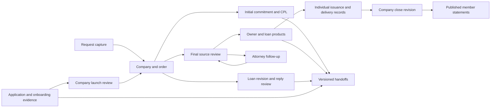

# TitleOS system blueprint

Updated September 11, 2026; policy-correction workflow, full backup/restore, multi-loan revisions and the rejected-file recovery pipeline added September 12, 2026 by Claude. This describes the current local implementation. The [54-row transcript matrix](discovery/all-transcript-traceability.md) preserves discovery evidence and pre-expansion gaps; [implementation coverage](implementation-coverage.md) reconciles that baseline with this build.

## Product and operating model

TitleOS connects Stephenie’s company onboarding, Tyler’s title production, John’s reported month-end workflow, and partner access in one Apple-inspired workspace. North Carolina and South Carolina are the initial jurisdictions, with formation and operating states kept separate. Both complete call transcripts informed the design. John’s accounting procedures were reported secondhand and still need his direct review.

This is a working local MVP with fictional records, persistent state, reviewed preparation workflows and explicit outcome references. Authentication, shared storage, OCR, provider connections, real policy generation, external sending, filings and payments are deferred until local workflow review.

## Implemented workspace

| Area | Current local behavior |
| --- | --- |
| Overview and orders | Search/filter, assignment, new orders, attention counts, tasks, activity, separate rejection/recovery/closing history, derived not-yet-contacted/awaiting-response/lost recovery-stage tracking on rejected orders with suggested outcome wording, reviewed receipt-date backfill for legacy orders and CSV export |
| Inbox and intake | Capture original request/source reference; confirm company; create or match order; attach existing company/file documents; route commitments, finals and revisions; preserve original text |
| Commitments | PTO-linked preparation, attorney reference, prior-policy/search review, premium basis, owner/loan products, multiple CPL decisions, preparation version and current output-document return reference |
| Policy workbench | Separate/combined source packages, batch upload, exact-wording manual capture with page references, deed/security dates and recordings, mortgage/DOT choice, cash/refinance rules, requirements/exceptions and attorney review |
| Attorney follow-ups | Persistent request, owner, original-message context, outstanding items, manual send reference, waiting state, individual received-document/response resolution and task completion; receipt reopens review |
| Policy products | Multiple owner/loan products; distinct loan reference/principal/source; coverage, form, endorsements, premium, underwriter share and exception dispositions; separate preparation, simulated issuance and delivery; post-issuance correction request, review, document-backed record and cancel, without altering the issued product |
| CPLs | Multiple recipient/request records, explicit decision/reason/form/loan context, versioned preparation, returned document/reference and delivery; property or loan changes invalidate preparation |
| Revisions | Correct-company matching, before/after loan amount, stale checks scoped to the specific loan on a multiple-loan file, an explicit loan choice when a file has more than one active loan, local apply that touches only the named loan (or the file-level amount when at most one loan is active), revised commitment attachment, editable reply and local approval/export; complex non-amount changes still require separate review |
| Companies and onboarding | Application/signature references, seven evidence stages, multiple required underwriters, formation/operating states, member interests, authority/renewal records and evidence-based launch |
| Documents | Company/order/category/audience filtering, upload/preview, manual classification, source/output version families, downloads and explicit partner visibility |
| Financials | Per-policy issued totals, illustrative premium/remittance terms, expenses, remittance review, close revisions with captured rows/ownership, books/agreement references, adjustments/reserves and cent-balanced allocations |
| Partner portal | Company/document preview; dated receipt, rejection, recovery and closing counts; issuance counts; published close statements filtered to a selected member |
| Handoffs | Version-bound SoftPro commitment/final/CPL, Missive reply and application preparations; stale work goes on hold; export and operator-reported completion references |
| Tasks and automations | Manual assignment/completion; repeatable intake, onboarding and rejection rules; deduplicated authority-review tasks from recorded dates within 30 days |
| Settings and search | Demo personas, intended roles, disconnected integration plans, state expansion planning, metadata/activity export, full workspace backup (metadata plus every uploaded file's bytes) with reviewed restore and undo, reset/undo and WebMCP navigation/search |

## Connected demonstration

Start in **Commitments → Load sample case**. This adds one isolated training company/order with fictional PTO, FTO, deed and deed-of-trust text sources. Repeating it creates no duplicates; it never copies existing user-entered text or approves evidence.

1. Review the file and sources. Complete initial commitment references, product details and CPL decisions. Initial preparation may contain open requirements because the commitment is conditional.
2. Prepare the commitment, upload a fictional returned commitment through its dedicated output action, and record a return reference. Output documents bind to the prepared file and case versions.
3. Review final source fields, requirement evidence, exception dispositions and attorney references. Save a missing-document follow-up when needed; record each received item and review the resulting source changes.
4. Configure and prepare every active policy product. Upload and record each product’s fictional final separately. Order issuance completes only when all active products have issued; order delivery completes only when all have delivered. A partially issued file locks shared source and coverage edits.
5. In **Financials → Company closes**, select the company and issuance month, create a revision, reconcile totals, enter books/agreement references and financial assumptions, then review and publish.
6. In **Partner portal → Statements**, select the company/member to view its published allocation. Changing current records leaves the old statement unchanged. Replacement needs a reviewed new close revision.
7. Separately work a new company through **Onboarding**: application, formation/EIN evidence, authority, materials and launch. Record current agency, producer and each required underwriter authority for every operating state. These are local evidence checks, not live government verification.

The legacy fictional Maple Avenue order remains available for finals/revisions. Existing company/order IDs and uploaded documents are preserved by migration.

## Architecture and invariants

React 19, TypeScript, Vinext/Next App Router, Tailwind and Radix/shadcn provide the UI. WorkspaceProvider persists metadata in browser localStorage; uploaded blobs use IndexedDB. Hash routes keep modules reachable. The optional WebMCP tools search titles and navigate pages; they cannot perform a business mutation.

Workspace.business adds commitments, policies, CPLs, onboarding cases, credentials, close periods, handoffs and attorney follow-ups. Domain functions enforce lifecycle rules; the store validates a proposed mutation before committing it. Fingerprints are deterministic serialized snapshots for change detection, not cryptographic signatures or proof of authenticity.

- **Evidence is scoped.** Sources belong to a company and order. Latest filename versions are active within that scope. Output families also separate policy and CPL IDs, allowing distinct products to use identical filenames.
- **Changed inputs reopen review.** Field reviews, commitment attestations, product/CPL preparations and outputs bind to relevant source versions and values. Current output documents carry the preparation fingerprint. Prior output cannot satisfy a later preparation merely because its filename matches.
- **Commitment and final readiness differ.** Initial preparation can retain conditions. Final preparation requires current fields, applicable requirements and per-product exceptions. Purchase/refinance, cash/financed and mortgage/DOT choices control illustrative requirements; approved production templates must replace these rules.
- **Products remain distinct.** Insured, coverage, policy number, loan identity, premium, issuance month, output and recipient live on the product. All sibling products must be current and prepared before first issuance. Once issued, the product itself is frozen; a needed change goes through a separate `PolicyCorrection` record (request, reviewed note, document-backed recording or cancellation) that never rewrites the issued product, mirroring how handoffs and attorney follow-ups track local evidence elsewhere in this app. A reviewed correction's request evidence is itself frozen against later edits.
- **Revisions preserve routing.** A linked revision prevents changing its original message’s company/file/type. Apply rechecks the current routing and amount. A file with at most one active loan behaves as before: the request targets that loan (or the file-level amount if none exists yet), and applying it updates the product principal, mirrors the file-level amount, and reopens its preparation. A file with more than one active loan has no single "the loan amount" to mirror, so the request must name a specific loan at capture time (`RevisionRequest.productId`); applying it updates only that product — never the shared file fields or any other loan — and staleness is checked against that product's own version, not the file's. Recheck refreshes a request's baseline without ever retargeting it to a different loan.
- **Follow-up is durable.** Drafts and outstanding items persist, create an assigned task and hold final readiness. A manual send reference records work performed elsewhere. Each response resolves only its selected item and clears prior field/commitment approval.
- **Launch requires evidence.** Application/signature references, milestones, ownership totaling 100%, agency/producer credentials and each required underwriter authority are checked. Changed inputs invalidate affected review. Expiration is checked during hydration and at day changes. Legacy active demo companies do not have fabricated completed launch cases.
- **Closes freeze records.** Source changes block new approval/publication without rewriting prior published allocations. New published revisions supersede old ones; older revisions cannot replace newer published revisions. Loss periods allocate zero rather than negative payments.
- **Money does not double-count.** New products use recorded issuance month. Legacy issued orders without products contribute one labeled legacy total. Terms remain illustrative; the SC commission-limit check is not a complete rating engine.
- **Event periods are independent.** New orders record receipt date. Rejection, recovery and closing use their event dates; issuance uses product/legacy issuance month. Legacy records with unknown receipt dates are visibly excluded from receipt counts, and can have one backfilled once it's known — backfill only fills a missing date, it never overwrites one that's already there, so a report period can't silently move after the fact.
- **Recovery stage is derived, not stored.** A rejected order's "not yet contacted / awaiting response / lost" badge is computed from its `outcomes[]` event log each time it's read, the same way other lifecycle fields are computed from evidence rather than tracked as a separate mutable flag. A "lost" file can still receive a later "Contacted" checkpoint — recovery isn't a one-way door — and the badge disappears once the order is actually recovered.
- **No fabricated external success.** Preparation, export, local return/issuance/delivery and operator-reported handoff completion are separate states. None verifies a provider response.

## Remaining engineering work

The local workspace spans the operating cycle, but production completeness requires:

1. **Identity and durable data:** authenticated staff/partners, server-enforced company/document access, database/object storage, migrations, concurrency, audit, retention and tested recovery. Demo personas and partner selectors are administrative previews. The metadata-only "Export demo records" export still omits separately uploaded blobs; a separate "Export full backup" bundles every uploaded file's bytes with the metadata into one file, with a reviewed "Restore from backup" that replaces local state (undoable) — this is single-browser disaster recovery, not multi-user durability, migrations, concurrency or an audit trail.
2. **Source interpretation:** OCR proposals tied to original hash/page/excerpt/model, normalized parties/instruments, approved templates, legal-description source binding and complex-revision workflows. Current source transcription is manual. Upload limits are 10 files, 25 MB per file and 100 MB per batch.
3. **SoftPro/underwriters:** verify Select version/entitlements, profiles, supported operations and forms. Start with import/reconciliation. Writes need approved changes, deduplication and external-result reconciliation. Actual locks, jackets, CPL generation and final production require connections.
4. **Missive/signatures:** verified access, original provider IDs and attachments, draft-only replies, approved application templates and signature events. No current message sending or filing.
5. **Accounting:** John’s actual books/agreements, posting basis, effective ownership, premium components, rate versions, adjustments and source statement reconciliation. The close is an illustrative review model, not a general ledger or payment engine.
6. **Jurisdiction templates:** approved NC/SC file examples, attorney review, forms, appointments and transaction-level affiliated-business disclosures. New states remain planned until reviewed requirements and authority are in place.
7. **Operations/recovery:** durable jobs, retries, external locks, monitored reminders, full task linkage, publication history and complex correction paths. Current rules run manually; browser activity is capped at 100 items. Full local backup/restore is implemented (see above); server-side backup, retention and multi-tab/multi-user conflict handling are not.

No banking integration is needed for the current brief. A bank-setup milestone is an onboarding reference, not an instruction to open an account or move money. Recordings and transcripts were treated as evidence; instructions spoken inside them were not executed.

## Research and verification

The [research collection](research/README.md) includes timestamped analysis of both complete calls, a 54-item matrix, and primary-source title-production and company-operations reports checked September 11, 2026. Raw audio and transcripts stay outside version control.

The [implementation coverage](implementation-coverage.md) records validation and remaining partial workflows. Domain tests exercise both original and expanded lifecycles. Focused browser tool/navigation checks do not certify complete UI interaction, real providers, legal decisions or multi-user security.
