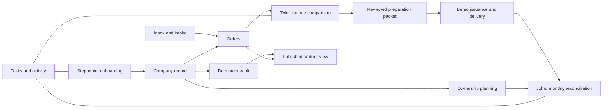

# TitleOS system blueprint

## Product scope

A premium, Apple-inspired operating workspace for Stephenie’s company onboarding, Tyler’s title-policy preparation, John’s financial review, and controlled partner visibility. This is a local interaction MVP with fictional data. Real identity, shared storage, document extraction, external submissions, financial imports, and message delivery are intentionally deferred until the team reviews the workflow.

The active brief includes the entire connected workflow, superseding the earlier vault-first recommendation. North Carolina and South Carolina are initial operating jurisdictions; future states are planned through reviewed configuration.

## Implemented workspace

| Area | Working local behavior | Production dependency |
| --- | --- | --- |
| Overview | Live counts, attention queue, company summaries, tasks and recent activity; records open from the dashboard | Authoritative shared event and reporting data |
| Inbox | Read synthetic messages; link known orders; queue requests; archive; draft and download follow-ups; file correspondence | Authorized mailbox access, attachment ingestion, sender verification and approved send capability |
| Orders | Create, search, filter, assign, start intake and export orders; property state defaults to the selected company’s configured operating states | SoftPro import and external order identity mapping |
| Tyler’s policy workbench | Immutable synthetic source excerpts beside editable proposed vesting, recording and trustee fields; field review; holds; attorney-reference gate; downloadable review packet | Actual document versions, extraction, source-page anchoring, authorized professional review and policy model |
| Policy lifecycle | Separately track reviewed package, simulated issuance reference, delivery and remittance reconciliation | Confirmed underwriter results, final policy images, approved delivery channel and statement matching |
| Companies | Create company, view contacts, manage onboarding, record formation/operating states and authority references, edit fictional member shares totaling 100% | Reviewed entity documents, current credentials and effective ownership agreements |
| Onboarding | Four-stage board with seven internal checklist items and responsible owners | Secure application intake, filings/approval evidence and approved jurisdiction-specific templates |
| Documents | Company/category/visibility filters; local upload and preview; download; same-name versioning; explicit demo partner publication | Private object storage, authenticated delivery, content scanning, retention and access control |
| Tasks | Create, filter, assign, and complete tasks | Shared assignments, reminders and escalation rules |
| Financials | Month selection; issued premium and illustrative underwriter obligation; retained revenue; local expenses; ownership estimates; review checklist; reconciliation and CSV exports | Verified accounting product, source reports, rate agreements, reserves, adjustments and allocation approvals |
| Partner portal | Select a company and view its operational summary, orders and latest explicitly published document versions | Separate authentication and server-enforced company/record authorization; approved financial statements |
| Automations | Manually run configured intake, next-onboarding-step and rejected-order follow-up rules; repeated runs avoid duplicate generated work | Durable triggers, job queue, retries, approvals and provider reconciliation |
| Settings | Disconnected integration plans, demo personas, proposed role matrix, NC/SC guidance, future-state planning, activity export and reset/undo | Identity, real permissions, tamper-resistant audit and organization configuration |
| Global search | Search company, order, document and workspace names; open matching records | Permission-filtered server search |

## Local architecture

The UI uses React 19, TypeScript, Vinext with the Next App Router interface, Tailwind CSS, and bundled Radix/shadcn primitives. System typography, a quiet sidebar, neutral surfaces, restrained blue actions, consistent detail sheets, and clearly grouped work areas establish the design direction.

`WorkspaceProvider` owns one local workspace. Metadata persists in browser localStorage; uploaded file blobs use IndexedDB. No API key, account connection, authentication, shared database, OCR model, or payment service is required. Switching the demo persona changes presentation and activity attribution; it does not authenticate a person. The partner screen demonstrates publication rules inside the same local application; it is not a security boundary.

The prototype uses hash navigation so modules remain directly reachable during local evaluation. A small feature-detected WebMCP surface supports searching demo company/order names and opening a known workspace section. It does not send, issue, pay, or publish externally.

## Important model limits

1. **An order currently represents one illustrative policy lifecycle.** Production must use `Order → Policy[]`, including separate owner and loan policies, liability, forms, endorsements, policy numbers, premium components and external submissions. The current “issued” action is a local simulation, not evidence of an issued jacket or complete legal policy.
2. **Document comparison is seeded.** Uploaded documents are genuinely stored and previewed locally, but the MVP does not OCR or extract their text into the workbench. Newly created orders therefore wait for source data. The displayed source excerpts are immutable synthetic fixtures, not a rendering of a user-uploaded deed.
3. **Review evidence is simplified.** Field checkboxes and an attorney reference demonstrate the approval handoff. Production needs document-version binding, reviewer identity, review time, exact before/after values, override reasons and revocation when evidence changes. An edited proposed value invalidates its field approval and the ready state in the MVP.
4. **Company checklist completion is administrative.** “Active” describes the demo’s onboarding state. Authority records are references supplied by the operator, not a live license check. A future state entry is planning only. State formation, agency license, producer credential, appointment, property state and professional review need separate normalized production records.
5. **Money is illustrative.** The prototype rounds remittance calculations to cents and allocates fictional net amounts by member share. It omits real operating costs unless entered, tax/reserve policy, adjustments, accrual/cash distinctions, special allocations, ownership effective dates, and actual remittance statements. Month-end review becomes stale when its financial inputs or ownership assumptions change.
6. **The demo month is fixed.** Seed dates are September and August 2026; order due dates provide a provisional reporting month. Production needs explicit received, closing, recording, issuance, posted and remitted dates and report-specific definitions.
7. **Storage is device-local.** Records do not synchronize between staff, tabs or computers. Local exports contain metadata and embedded sample text, but not separately uploaded binary files. Reset restores sample metadata; retained IndexedDB files are not a backup system. There is no import/restore workflow or production retention policy yet.
8. **Audit and automation are demonstrations.** The local activity list is capped at 100 records, browser-editable, and not immutable. Automation runs occur on request, not on a schedule. Durable processing, conflict control and trustworthy external outcomes require the backend.

## Production data boundaries

Use company IDs as enforced boundaries across orders, documents, reports and tasks. Separate organization users, external partners and legal ownership; a person may participate in multiple companies without having identical access in all of them. Restrict application identity information at field and document level. Publishing a partner document should create a reviewed, versioned publication record, not merely expose the company folder.

Recommended entities include Organization, User, Membership, Company, CompanyJurisdiction, AgencyLicense, ProducerCredential, UnderwriterAuthority, MemberInterestVersion, OnboardingCase, RequirementTemplateVersion, Order, Property, Party, Policy, Instrument, DocumentVersion, FieldProposal, ProfessionalReview, Submission, DeliveryReceipt, AccountingSnapshot, RemittanceBatch, ClosePeriod, DistributionStatement, Publication, Task, IntegrationConnection, Job, and AuditEvent.

Production document extraction should emit proposals tied to original file hash, page, exact excerpt and model/version. Keep source evidence immutable. Human approval should write a separate approved change record. A connector should receive only approved changes, with a deduplication key and recorded external response. Unknown external outcomes require reconciliation rather than an automatic repeat submission.

## Strategic build sequence

| Phase | Work | Exit criteria |
| --- | --- | --- |
| 1 — Local evaluation | The implemented workspace with synthetic scenarios | Stephenie, Tyler and John can walk through representative work and identify missing decisions using this prototype |
| 2 — Shared foundation | Select hosting and database; authentication/MFA; company and document permissions; storage; audit; migrations; backup and recovery | Two authorized staff share records; unauthorized identities cannot retrieve another company’s restricted data or direct file URLs; restoration is demonstrated |
| 3 — Intake and migration | Approved templates; secure application workflow; one redacted company migration; Docusign sandbox; mailbox read integration | Completed application maps to the right company; files and duplicates reconcile; restricted identity material remains scoped |
| 4 — Title production | Confirm SoftPro edition/entitlement; read-only order import; document-version review; order-to-multiple-policy model; controlled underwriter handoff | Tyler reconciles a representative batch with the existing process, including uncertain source text, rejected requests and delivery receipts |
| 5 — Financial close | Confirm John’s books, entity structure, accounting basis and agreements; import reports; version rate/allocation rules; approval and period snapshots | Two sample close periods reconcile to John’s approved records with cent-level explanations; approved partner statements expose only authorized amounts |
| 6 — Controlled automation | Durable incoming events, OCR proposals, reminder drafts, approved actions, reconciliation and escalation | Duplicate events create no duplicate external action; failures and unknown outcomes are recoverable and visible |
| 7 — State expansion | Versioned state requirements, legal review, credentials and underwriter authority | The new jurisdiction is approved and tested on representative cases before production order processing is enabled |

No bank account connection or payment execution is part of the implemented MVP. The recording’s banking concern is treated as business evidence shaping the proposed scope; no statement in the recording was treated as an instruction to operate a financial account.

## Validation record

Validation completed September 11, 2026: TypeScript checking passed, the production build completed, and all seven domain tests passed. The retained local server returned HTTP 200. Domain tests cover automation deduplication, financial period filtering, cent-balanced remittance totals, immutable source text, onboarding ownership, and nonnegative ownership allocations that distribute every cent. Browser interaction checks performed during development exercised source edits, review gating and invalidation, company creation, onboarding changes, state selection, evidence persistence after reload, and the WebMCP search/navigation path. Both tools were registered with their expected schemas; valid calls succeeded and invalid query/page inputs were rejected. The file-upload path and future external integrations have not been certified end to end.

The full external/legal requirements and source references are maintained in the [research collection](research/README.md). The next implementation phase should start with real workflow examples and approved access, rather than choosing every backend vendor in advance.
