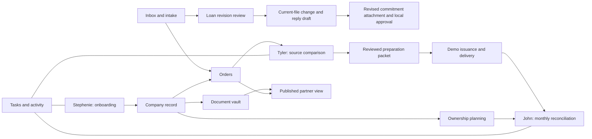

# TitleOS system blueprint

## Product scope

A premium, Apple-inspired operating workspace for Stephenie’s company onboarding, Tyler’s title-policy preparation, John’s financial review, and controlled partner visibility. This is a local interaction MVP with fictional data. Real identity, shared storage, document extraction, external submissions, financial imports, and message delivery are intentionally deferred until the team reviews the workflow.

The active brief includes the entire connected workflow. Tyler’s additional call prioritizes final-policy preparation, followed by simple commitment revisions, within that workspace. North Carolina and South Carolina are initial operating jurisdictions; future states are planned through reviewed configuration.

## Implemented workspace

| Area | Working local behavior | Production dependency |
| --- | --- | --- |
| Overview | Live counts, attention queue, company summaries, tasks and recent activity; records open from the dashboard | Authoritative shared event and reporting data |
| Inbox | Read synthetic messages; link known orders; queue requests; archive; draft and download follow-ups; file correspondence | Authorized mailbox access, attachment ingestion, sender verification and approved send capability |
| Orders | Create, search, filter, assign, start intake and export orders; property state defaults to the selected company’s configured operating states | SoftPro import and external order identity mapping |
| Tyler’s policy workbench | Order-linked source packages; batch upload; manual field capture with page references; distinct deed/DOT dates and recording details; cash/refinance gates; commitment requirements and exception review; source-version invalidation; attorney-reference gate; downloadable preparation packet | OCR proposals, authenticated professional review, approved file-type rules, production policy model and SoftPro connector |
| Revisions | Company/file matching; loan before/after comparison; confirmation; stale-version protection; local file update; editable reply draft; attachment bound to the current revision; local approval and text export | Authorized SoftPro Select update/regeneration, revision reconciliation, Missive draft creation and thread mapping |
| Policy lifecycle | Separately track reviewed package, simulated issuance reference, delivery and remittance reconciliation | Confirmed underwriter results, final policy images, approved delivery channel and statement matching |
| Companies | Create company, view contacts, manage onboarding, record formation/operating states and authority references, edit fictional member shares totaling 100% | Reviewed entity documents, current credentials and effective ownership agreements |
| Onboarding | Four-stage board with seven internal checklist items and responsible owners | Secure application intake, filings/approval evidence and approved jurisdiction-specific templates |
| Documents | Company/category/visibility filters; local batch upload and preview; order/source-role linking; download; company/order-scoped same-name versioning; explicit demo partner publication | Private object storage, authenticated delivery, content scanning, retention and access control |
| Tasks | Create, filter, assign, and complete tasks | Shared assignments, reminders and escalation rules |
| Financials | Month selection; issued premium and illustrative underwriter obligation; retained revenue; local expenses; ownership estimates; review checklist; reconciliation and CSV exports | Verified accounting product, source reports, rate agreements, reserves, adjustments and allocation approvals |
| Partner portal | Select a company and view its operational summary, orders and latest explicitly published document versions | Separate authentication and server-enforced company/record authorization; approved financial statements |
| Automations | Manually run configured intake, next-onboarding-step and rejected-order follow-up rules; repeated runs avoid duplicate generated work | Durable triggers, job queue, retries, approvals and provider reconciliation |
| Settings | Disconnected integration plans, demo personas, proposed role matrix, NC/SC guidance, future-state planning, activity export and reset/undo | Identity, real permissions, tamper-resistant audit and organization configuration |
| Global search | Search company, order, document and workspace names; open matching records | Permission-filtered server search |

## Local architecture

The UI uses React 19, TypeScript, Vinext with the Next App Router interface, Tailwind CSS, and bundled Radix/shadcn primitives. System typography, a quiet sidebar, neutral surfaces, restrained blue actions, consistent detail sheets, and clearly grouped work areas establish the design direction.

`WorkspaceProvider` owns one local workspace. Metadata persists in browser localStorage; uploaded file blobs use IndexedDB. No API key, account connection, authentication, shared database, OCR model, or payment service is required. Switching the demo persona changes presentation and activity attribution; it does not authenticate a person. The partner screen demonstrates publication rules inside the same local application; it is not a security boundary.

The prototype uses hash navigation so modules remain directly reachable during local evaluation. A small feature-detected WebMCP surface supports searching demo company/order names and opening a known workspace section. It does not send, issue, pay, or publish externally.

## Important model limits

1. **An order currently represents one illustrative policy lifecycle.** Production must use `Order → Policy[]`, including separate owner and loan policies, liability, forms, endorsements, policy numbers, premium components and external submissions. The current “issued” action is a local simulation, not evidence of an issued jacket or complete legal policy.
2. **Source capture is manual.** Uploads are stored and previewed locally, then the operator enters the source wording and page reference. New orders can therefore be worked through without seeded comparison fields, but there is no OCR or AI extraction. Combined PDFs can have section-reference records linked to their parent document. Source text is independent of proposed corrections, but the app cannot verify the operator's transcription. The sample packets are fictional, not signed opinions or recorded instruments. Upload limits are 10 files, 25 MB per file and 100 MB per batch.
3. **Review evidence remains local.** Fields bind to document IDs and page references; only the latest company/order/filename version is active. Replaced source documents invalidate affected review, and a commitment-review snapshot binds the attestation to the current source package, requirements, financing and selected context. A reviewed empty requirement list requires an explicit note. Changed loan amounts must reconcile with the captured deed-of-trust amount. Reply approval requires a revised commitment uploaded for the same file version. Reviewer names, timestamps and activity are still browser-controlled rather than authenticated audit evidence. The exported packet is a review artifact, not a legally complete policy or externally validated clearance decision.
4. **Company checklist completion is administrative.** “Active” describes the demo’s onboarding state. Authority records are references supplied by the operator, not a live license check. A future state entry is planning only. State formation, agency license, producer credential, appointment, property state and professional review need separate normalized production records.
5. **Money is illustrative.** The prototype rounds remittance calculations to cents and allocates fictional net amounts by member share. It omits real operating costs unless entered, tax/reserve policy, adjustments, accrual/cash distinctions, special allocations, ownership effective dates, and actual remittance statements. Month-end review becomes stale when its financial inputs or ownership assumptions change.
6. **The demo month is fixed.** Seed dates are September and August 2026; order due dates provide a provisional reporting month. Production needs explicit received, closing, recording, issuance, posted and remitted dates and report-specific definitions.
7. **Storage is device-local.** Records do not synchronize between staff, tabs or computers. Local exports contain metadata and embedded sample text, but not separately uploaded binary files. Reset restores sample metadata; retained IndexedDB files are not a backup system. There is no import/restore workflow or production retention policy yet.
8. **Audit and automation are demonstrations.** The local activity list is capped at 100 records, browser-editable, and not immutable. Automation runs occur on request, not on a schedule. Durable processing, conflict control and trustworthy external outcomes require the backend.

## Tyler-specific workflow boundaries

Finals and revisions are separate queues. Initial commitments, CPL generation and complex legal revisions remain future workflows; file details capture context without manufacturing approved forms. Cash versus financed and purchase versus refinance currently control illustrative source requirements; approved NC/SC templates must determine the production rules. CPL choice is recorded for review and is not inferred to be legally unnecessary merely because a file is cash.

Each simple revision preserves its original email text and before/after amount, checks the company and current file version, and generates a local reply draft only after confirmation. If a file becomes cash, issued or rejected, the revision can no longer be applied. A revised commitment needs a distinct filename from final-source evidence. A changed file or superseded attachment makes the earlier reply unsuitable for approval. The export labels stale drafts for renewed review. No PDF generation, SoftPro write, Missive draft API call or email send occurs.

Migration preserves existing local companies and edits. The first migration adds synthetic source packages only to known demonstration orders and reopens their prior field approvals because the new final-readiness requirements were not previously reviewed. It does not fabricate sources for new user orders.

## Production data boundaries

Use company IDs as enforced boundaries across orders, documents, reports and tasks. Separate organization users, external partners and legal ownership; a person may participate in multiple companies without having identical access in all of them. Restrict application identity information at field and document level. Publishing a partner document should create a reviewed, versioned publication record, not merely expose the company folder.

Recommended entities include Organization, User, Membership, Company, CompanyJurisdiction, AgencyLicense, ProducerCredential, UnderwriterAuthority, MemberInterestVersion, OnboardingCase, RequirementTemplateVersion, Order, Property, Party, Policy, Instrument, DocumentVersion, FieldProposal, ProfessionalReview, Submission, DeliveryReceipt, AccountingSnapshot, RemittanceBatch, ClosePeriod, DistributionStatement, Publication, Task, IntegrationConnection, Job, and AuditEvent.

Production document extraction should emit proposals tied to original file hash, page, exact excerpt and model/version. Keep source evidence immutable. Human approval should write a separate approved change record. A connector should receive only approved changes, with a deduplication key and recorded external response. Unknown external outcomes require reconciliation rather than an automatic repeat submission.

## Strategic build sequence

| Phase | Work | Exit criteria |
| --- | --- | --- |
| 1 — Local evaluation | The implemented workspace with synthetic scenarios | Stephenie, Tyler and John can walk through representative work and identify missing decisions using this prototype |
| 2 — Shared foundation | Select hosting and database; authentication/MFA; company and document permissions; storage; audit; migrations; backup and recovery | Two authorized staff share records; unauthorized identities cannot retrieve another company’s restricted data or direct file URLs; restoration is demonstrated |
| 3 — Intake and migration | Approved templates; secure application workflow; one redacted company migration; Docusign sandbox; Missive read and draft-only integration | Completed application maps to the right company; files and duplicates reconcile; restricted identity material remains scoped |
| 4 — Title production | Verify SoftPro Select version/entitlements and company profiles; read-only order import; finals and loan-revision pilots; document-version review; order-to-multiple-policy model; controlled underwriter handoff | Tyler reconciles a representative batch with the existing process, including uncertain source text, rejected requests and delivery receipts |
| 5 — Financial close | Confirm John’s books, entity structure, accounting basis and agreements; import reports; version rate/allocation rules; approval and period snapshots | Two sample close periods reconcile to John’s approved records with cent-level explanations; approved partner statements expose only authorized amounts |
| 6 — Controlled automation | Durable incoming events, OCR proposals, reminder drafts, approved actions, reconciliation and escalation | Duplicate events create no duplicate external action; failures and unknown outcomes are recoverable and visible |
| 7 — State expansion | Versioned state requirements, legal review, credentials and underwriter authority | The new jurisdiction is approved and tested on representative cases before production order processing is enabled |

No bank account connection or payment execution is part of the implemented MVP. The recording’s banking concern is treated as business evidence shaping the proposed scope; no statement in the recording was treated as an instruction to operate a financial account.

## Validation record

Validation is recorded for September 11, 2026. The original MVP passed TypeScript checking, the production build and seven domain tests, with browser interaction checks for source edits, review gating, company creation, onboarding changes and persistence. The Tyler extension adds domain coverage for final readiness, explicit commitment review, cash/refinance distinctions, company-scoped evidence, loan conflicts, stale and duplicate revisions, source replacement, immutable current values, attachment/file-version matching, and migration preservation. The extension passed all 19 domain tests, TypeScript checking and the production build. The retained localhost server returned HTTP 200. Both WebMCP tools registered with the expected schemas; a valid search and navigation to Revisions succeeded, invalid query/page inputs were rejected, and focused readback confirmed the Revisions page remained intact. The upload path and external integrations have not been certified end to end; browser interaction testing from the original MVP is not a claim that the new upload and revision screens were exercised in a browser.

The full external/legal requirements and source references are maintained in the [research collection](research/README.md). The next implementation phase should start with real workflow examples and approved access, rather than choosing every backend vendor in advance.
